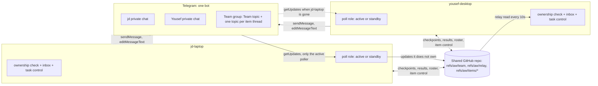

# Teammate design proposal: one team bot, item threads and handover

Status: SUPERSEDED on 2026-09-16 by [teammate-design.md](teammate-design.md), which is the design of record.
Kept as history, with [the review notes](teammate-design-review-notes.md), because it records the alternatives that were considered and rejected (shared bot, poll election, repository relay, forum topics, custom checkpoint refs).
Original status: proposal for jd's review, 2026-09-15.
Nothing here is accepted until jd approves it; accepted decisions D01-D17 stay in force until then.
Parent: [Design baseline](README.md).
Replaces, once accepted: the teammate parts of [User flows](user-flows.md) sections 4-7, [Protocol](protocol.md) sections 2, 4, 5, 7 and 8, and milestones M3-M5 and L2 of the [engineering plan](engineering-plan.md).

## 1. Summary

A team is two people, each running this app on their own workstation with their own LLM subscription, sharing one private GitHub repository and one Telegram bot that jd owns.
The teammate joins by pasting a join code from jd's app into their app and tapping two Telegram links; they never open BotFather.
Every joined workstation holds the bot token and sends its own messages directly.
Exactly one online workstation long-polls the bot at a time; the others stand by and take over when it goes quiet.
Telegram's own 409 Conflict is the lock, so no clock, lease file or heartbeat is needed to elect the poller.

Updates are routed by local ownership, which each workstation can already decide from its own database: its own action references, its own sent messages, its own topics, its own paired private chat.
The poller handles what it owns and appends everything else to a small relay log in the shared repository, which the other workstations read every 10 seconds.
The relay is the only new machine-to-machine channel; humans only ever talk through Telegram, and the repository otherwise carries files (checkpoints and results).

Teamwork happens in one item thread: a forum topic in one private team group, one topic per work item that someone chose to share.
A thread has three levels on the same topic and the same records:

1. **Discuss** (R-B): the starter shares the item; the other person reads and talks; read-only commands only.
2. **Grant** (R-B): the starter grants the other person named commands on this item on the starter's workstation (context, answer, resume), revocable at any time.
3. **Handover** (R-A): the item runs on the other person's workstation from a published checkpoint, then comes back for review and apply.

Personal control (L1, L3) is unchanged and stays in each person's private chat with the bot.
Every state change, at every level, is an action reference with a durable receipt and a revision check on the workstation that owns it (D17).

Size of the change: 8 build slices plus one harness slice, 49 new automated scenarios (14 T0, 35 T1) on the existing fake Telegram, 5 real-Telegram checks and 1 real-GitHub check that two people run in about 30 minutes in total, plus 1 optional handover smoke.

## 2. Requirements restated

| ID | Requirement | Interpretation flagged |
| --- | --- | --- |
| R-A | When one person's LLM allowance is about to run out, the other can continue the task on their own workstation. | Kept as named handover with checkpoint, accept, run, return and apply. The receiver runs it under their own login and subscription; whether that satisfies G01 is jd's recorded decision (Q8). |
| R-B | Either person can start a Telegram thread about a work item to discuss it, with no handover and no quota trigger; the starter can grant the other person commands that act on the starter's workstation for that item. | "The other participant" is read as exactly one other person. The data model keeps person ids so a third member does not need a redesign, but nothing here is built or tested for three. |
| R-C | Telegram carries all human messaging and pushes notifications; the repository carries files. | Interpreted: the repository also carries small machine records that no human reads (roster, item control state, the update relay). Without a hosted service there is no other shared channel between two workstations; see section 4.3 and Q1. |
| R-D | Exactly one bot, jd's; teammates never touch BotFather; teammate setup under a minute. | jd sets up the group once (about 3 minutes). The teammate's minute starts when they have the join code. |
| R-E | No dependency on jd's workstation being online. | Holds for polling, relay, threads on Yousef's items, grants on Yousef's items, handover execution and joining with an already issued code. Anything that acts on jd's workstation (his items, his grants, applying a result to his tree) waits for it, by D01. |
| R-F | Lean evidence: mostly T0 and T1 on the fake Telegram, a small counted set of real checks two people run in minutes. | Section 8. The GramJS user client and the T3 automation are not used for team features. |
| R-G | Telegram-only participants without the app are out of scope. | Accepted. Group members who are not on the roster are ignored. |

## 3. What changes from the accepted design

### 3.1 Decisions

| ID | Proposal | Reason |
| --- | --- | --- |
| D01 | Keep. | Execution, database and LLM credentials stay local. The bot token is not an LLM credential. |
| D02 | Revise, see 3.2. | One bot per workstation is replaced by one team bot. |
| D03 | Keep. | |
| D04 | Revise, see 3.2. | One team group with a topic per shared item; narrower audiences deferred. |
| D05 | Revise, see 3.2. | The repository carries files plus the small machine records the single bot needs. |
| D06 | Keep. | |
| D07 | Keep. The "Request takeover" choice becomes "Start handover", which opens the item thread. | |
| D08 | Keep. | |
| D09 | Keep, with the comparison simplified (section 3.3, protocol 8). | |
| D10 | Revise, see 3.2. | It was written for handover and must not govern R-B threads. |
| D11 | Keep. | |
| D12 | Keep. | |
| D13 | Keep. "The same shared conversation" is the item thread; a handover and any later handover stay in that topic. | |
| D14 | Keep. | |
| D15 | Revise, see 3.2. | A poller receiving an update is not the owning workstation receiving it. |
| D16 | Revise, see 3.2. | Personal, thread and handover capabilities enable separately, with different gates. |
| D17 | Revise, see 3.2. | Extends the command rule to participants in item threads. |
| D18 | New, see 3.2. | Polling ownership and routing for a shared bot. |
| D19 | New, see 3.2. | Thread authority and grants. |

### 3.2 Revision texts

**D02.**
Old: "No custom central relay is required in the baseline. Each workstation uses its own Telegram bot in a shared task conversation."
New: "No custom central relay is required. A team uses one Telegram bot, owned by the team owner; every joined workstation holds its token and sends its own messages. Exactly one online workstation polls the bot at a time (D18). A single operator who never forms a team keeps using their own bot."
Reason: jd's requirement of a single bot and plug-and-play joining.

**D04.**
Old: "Use one task topic in a private project group where the audience is appropriate. Link a separately created private group when task membership must be narrower."
New: "A team has one private Telegram supergroup with topics. It holds one Team topic and one topic per shared work item (an item thread). Personal items stay in each person's private chat with the bot. Narrower per-item audiences are deferred."
Reason: a two-person team has no narrower audience; personal items and quota stay private without new rules.

**D05.**
Old: "Publish versioned project state and continuation context through a private Git remote. Do not use one network-mounted working directory or share a live SQLite file."
New: "Publish checkpoints, results and their context through the team's private Git remote. The same remote carries three small machine records under `refs/aw/`: the team roster, item control state and the update relay (D18). Human messaging never goes through Git. Do not use a network-mounted working directory or share a live SQLite file."
Reason: without a hosted service, Git is the only shared store both workstations already trust and reach.

**D10.**
Old: "The requester owns requirement decisions; the executor owns local access, provider and allowance decisions. Discussion alone grants neither authority."
New: "During a handover, the requester owns requirement decisions and the executor owns local access, provider and allowance decisions. In an item thread without a handover, D19 applies instead. Discussion alone grants no authority in either case."
Reason: R-B threads need their own rule.

**D15.**
Old: "Internet-connected Telegram is not evidence that a workstation is online. Never label a request accepted, running or stopped without the corresponding durable acknowledgement."
New: add "A workstation that polls or relays an update for another workstation may say it received and passed it on, and must never speak for the owner's outcome."
Reason: with a shared bot the toast often comes from a workstation that does not own the action.

**D16.**
Old: "Personal live Telegram control and teammate task transfer are separately enablable capabilities with separate gates. Personal single-operator control requires only that operator's own local setup and MUST NOT be blocked by the teammate-delegation gates G01-G03. ..." (rest unchanged).
New: "Three capabilities enable separately. Personal control needs only the operator's setup; on a joined workstation it also uses the team relay. Item threads and grants (R-B) need a joined team and no G01-G03 gate, because nothing runs on another person's workstation or subscription. Handover (R-A) needs a joined team and G01 and G02 as revised in 3.3. A fake transport is a development tool, not a shipping state." (the rest of the old text stays).
Reason: R-B should not wait for handover's gates.

**D17.**
Old: "The personal phone surface (L3) gives the operator enough context to decide from the phone, one thread per task plus a Workstation thread, and read-only status commands. Status commands and navigation buttons read local state only: no LLM call, no receipt, no state change. Anything that changes state stays an action reference with receipts and revision checks. LLM free chat is not part of it."
New: add "The same rule holds for every participant in an item thread. A slash command that would change state only renders an action card bound to the current revision; the tap on that card is the action, validated and receipted by the workstation that owns it."
Reason: jd asked for granted slash commands that change state.

**D18 (new).**
"Any joined workstation may become the poller. The active poller long-polls continuously; standby workstations probe rarely and yield on 409 Conflict. Each workstation acts only on updates it owns by its own records; the poller relays the rest through `refs/aw/relay`. No election depends on clocks. A workstation saves an update durably before its offset confirms it."

**D19 (new).**
"An item thread is started by the person whose workstation owns the item (the starter). Without a handover the starter holds every decision about the item. The other person may read the thread and use read-only commands. The starter may grant named capabilities (context, answer, resume) for that item only; a grant is revocable, ends when the thread closes or a handover starts, and never includes provider, permission, access or scope decisions, which stay with the starter's workstation settings. Grants are checked when a tap is applied, not when a card is shown."

### 3.3 Gates, boundaries, flows and milestones

| Item | Proposal | Reason and new text |
| --- | --- | --- |
| G01 subscription delegation | Keep for handover only; does not gate threads or grants. | A grant resumes on the starter's own subscription on the starter's own workstation. For handover, jd records whether the receiver running on their own login counts as ordinary use (Q8). |
| G02 permissions and secrets | Revise. | New: "For the trusted two-person team, the shared bot token and Git credentials being readable by same-user agent processes is a documented accepted risk (section 7). Any wider release reinstates certified isolation." |
| G03 remote integrity | Revise. | New: "Control refs are updated only by fast-forward or compare-and-swap push; a non-fast-forward rewrite detected on fetch disables handover until inspected." Device signatures and a signed roster are removed: with a shared bot token, a signature cannot tell the two trusted people apart any better than repository write access does. |
| G04 team governance | Revise. | New: "jd records the team's audience (two people), storage (the shared GitHub repository and the team group) and retention (relay 7 days, everything else kept) once, in `implementation.md`." |
| README boundary "One bot per registered workstation ... do not clone bot tokens" | Remove. | Contradicts jd's single-bot requirement. |
| README boundary "If a bot's workstation is offline, its buttons cannot be processed immediately" | Revise. | New: "A tap is processed when its owning workstation is online. While any workstation polls, the tap is kept in the relay; while none polls, Telegram drops it after about 2.5 minutes, so open cards get fresh buttons when their workstation returns." |
| User flows 4 "Its own bot posts Accept and run ... Do not put the only execution approval button on the sender's bot" | Revise. | New: "The receiver's workstation posts Accept and run after it discovers the offer; that workstation created the action reference, so it owns the tap whichever workstation polls." |
| User flows 4 offline nuance | Revise. | Replace "a button tap is pending Telegram delivery" with the measured rule above. |
| User flows 5 decision owner table | Keep for handover; add D19 for threads. | |
| User flows 6 "next offer requires the original requester's authorization of the next recipient" | Defer. | Two people: a further handover can only go back to the requester. |
| Protocol 2 roster signing, device keys, control-signing key | Remove (G03 revision). | |
| Protocol 3 records Approval, Command, Event, Run attempt | Simplify: item control state and events only, section 6. | |
| Protocol 4 signed control branches under `refs/heads/aw/...` | Revise: unsigned records under `refs/aw/...`, fast-forward or compare-and-swap only. | Avoids triggering push workflows on branches; confirmed by LG-1. |
| Protocol 5 lifecycle | Simplify: LOCAL, OFFERED, CLAIMED, RUNNING, RETURNED, APPLIED, WITHDRAWN, CANCELLED, with epochs kept. STOP_REQUESTED across workstations is deferred. | Remote stop needs the local Stop control first (L3 follow-up 1). |
| Protocol 7 "Each local bot has one long-poll receiver" | Revise per D18. | |
| Protocol 8 full capability comparison | Defer; compare the settings the app actually has (provider, model, Host access, sandbox mode, permission mode). Anything else is unknown and asks locally. | The enforceable capability model does not exist yet and is not needed for two trusted people. |
| Protocol 9 separate staged-state metadata | Remove. A checkpoint is one snapshot commit of tracked and untracked, non-ignored files, made with a temporary index so the user's HEAD, index and worktree are untouched. | Staged state is the user's local choice and does not travel. |
| M3 | Revise into slice TM6. | Package capture and control refs, no signing. |
| M4 | Revise into slice TM7. | Receiver card by the receiver's workstation, shared bot. |
| M5 | Revise into slice TM8. | Questions across workstations, return, apply. Further handover deferred. |
| M6 | Keep backup and restore; defer CI. | Unchanged by this proposal. |
| L2 | Remove; replaced by slices TM4 and TM5. | The team surface is item threads, not an offer board. |
| L3 C1 thread registry | Keep and extend with team subjects (TM4). | |
| L3 C0, C2 private-chat topics | Keep, independent of this proposal. | Personal only. |
| Acceptance scenarios T13-T36 in implementation.md | Replaced for team features by section 8. | |

## 4. Architecture

### 4.1 Code facts this design is built on (checked 2026-09-15)

- The bot record id is `telegram-<numeric bot id>` (`runtime.ts`), identical on every workstation that holds the token, so `telegram_inbox`'s primary key `(bot_id, update_id)` already deduplicates an update that arrives both by polling and by relay.
- `TelegramAdapter.processPendingCallbacks` processes saved inbox rows whatever put them there, and the poll loop waits for the delivery in progress first (cb74fce).
  Relayed updates inserted into the inbox get both for free.
- The fake Telegram server already resolves an older held `getUpdates` with 409 when a newer one arrives, drops unconfirmed taps after 145 seconds, refuses callback answers after 15 seconds, can delay a send response, and supports forum topics.
- `handleMessage` answers "That message is not a task question" to any reply it cannot match; with two workstations this would answer replies meant for the other one.
- `notifyWaitingTasks` posts every waiting task to every enrolled actor; a group actor would receive all personal questions.
- `taskControlActorFor` matches `topic_id` exactly; item topics are created dynamically.
- `task_control_action.action` is constrained to `save_human_response` and `answer_and_resume`.
- The token is read once from `TELEGRAM_BOT_TOKEN` at boot; a join inside the app needs a reloadable credential.
- `taskSummary` accepts only the `owner` audience and says team cards must hide quota.
- Harness environments use fixed ports 4100 and 3100.

### 4.2 Join flow and token distribution

One-time team creation by jd (about 3 minutes, jd's app online):

1. jd creates a Telegram supergroup, turns on Topics, adds the bot as administrator with Manage topics, Pin messages and Invite users. (Bots cannot create groups.)
2. In the Agents page, jd chooses Create team; the app shows a code; jd sends `/team <code>` in the group.
3. jd's workstation observes the chat, checks `is_forum` and the bot's administrator rights with `getChatMember`, asks jd to confirm locally, creates the Team topic, and writes `refs/aw/team` to the repository: team id, bot id and username, group chat id, Team topic id, jd as person and jd-laptop as workstation.

Inviting Yousef (jd's app, seconds): Invite teammate produces a join code, shown once, to send them privately.
The code is `awj1.` plus base64url JSON: version, team id, bot token, bot id, group chat id, repository remote URL, invite id, expiry (24 hours).
It is a secret because it carries the token (section 7).

Yousef's minute (jd's app may be offline):

1. Yousef pastes the code into Join team on their Agents page.
   Their app checks the token with `getMe`, checks the repository remote is reachable with `git ls-remote` using their existing Git credentials, and finds or asks for the local workspace with that remote.
   It stores the token in `.agent-console/secrets/telegram-bot-token` (mode 600), never in settings, `.env`, the database or a response, and starts the transport without a restart.
2. Their app shows a pairing link `t.me/<bot>?start=<pairing code>`; they tap it and press Start.
   Whichever workstation polls receives it; if it is not theirs, it relays it; their app matches its own pairing code and shows the observed Telegram identity for local confirmation (the existing L1 pairing flow).
3. On confirmation their app records the invite id as used and adds their person and workstation to `refs/aw/team` by compare-and-swap push; a second use of the same invite loses the race and is refused.
   It then asks the bot for a one-member, one-hour group invite link (`createChatInviteLink`) and shows it; they tap it and join the group.

Token rotation: jd revokes the token in BotFather, pastes the new token in his app, and sends Yousef a rejoin code; their roster entry is kept.
Removing a teammate: jd removes them from the roster; his workstation disables their actors and grants; he removes them from the group and rotates the token.

### 4.3 Polling ownership and failover

Each workstation's poll loop runs in one of two roles.
With one workstation it is always active, which is exactly today's behaviour.

| Role | Behaviour |
| --- | --- |
| Active | Long-poll 25 seconds, re-poll at once. On a 409, re-poll at once. After 3 consecutive 409s with no successful poll between them, become standby. |
| Standby | Every 20 seconds plus up to 10 seconds of jitter, send one long poll. A 409 means another poller is alive: stay standby. A poll that returns updates or holds without conflict means no one else is polling: become active. |
| Either | Save updates to the inbox before any later call's offset confirms them. A workstation whose relay push has failed for 60 seconds becomes standby with a 120-second probe interval, so a peer with a working repository takes over. |

Why this is enough:

- Telegram guarantees at most one held `getUpdates` per bot; whichever request Telegram terminates, the loser sees 409, so the rules converge whether the newer or the older request wins (LT-1 records which).
- Split brain (both active, for example after a laptop wakes from sleep) makes both see repeated 409s within milliseconds; both step down after 3, and the jittered probes pick one.
- A standby probe that lands on a live active costs the active one terminated poll; any updates it happens to receive are saved and relayed like any other.
- A workstation's cursor only ever covers updates it saved, and Telegram never re-delivers confirmed updates, so a stale cursor after takeover yields at most the previous poller's last unconfirmed batch, which the inbox key deduplicates.
- Failover takes at most about 55 seconds (the active's last poll plus one probe interval), inside Telegram's measured 145-second window for taps.
- No step compares clocks between workstations.

Failure modes:

| Case | Behaviour |
| --- | --- |
| Active stops or loses network | Standby takes over within about 55 seconds. Taps made in that gap arrive; messages always arrive. |
| Split brain | Converges in a few requests; duplicates are removed by update id; every action is idempotent by its command id `tg-callback-<callback query id>`. |
| Both offline | Messages wait in Telegram for 24 hours. Taps older than about 2.5 minutes are lost. When a workstation returns, it first imports the relay and polls, then edits each of its still-open cards with fresh buttons and the line "Buttons renewed after this workstation was offline. Tap again if you already did." |
| Repository unreachable for the active | It stands down (above). If the repository is unreachable for everyone, each workstation still serves updates it owns; relayed ones wait in the poller's local relay queue. |
| Token revoked | Every workstation gets 401 and shows "The team bot token was revoked. Ask jd for a rejoin code." with the existing 5-minute auth retry. |
| Webhook set on the bot | Every poll gets 409 and never succeeds; `getWebhookInfo` confirms it and the panel says so with a local Delete webhook button. Never deleted automatically. |
| Clock skew | Nothing depends on it. Each workstation compares its clock with Telegram's `date` on updates and warns above 60 seconds, because local TTLs and "as of" times would look wrong to the other person. |
| Two app versions | Relay records and the roster carry a schema version; an unknown version is kept, not processed, and the panel asks for an update. |

Alternatives considered:

- A lease file in Git with heartbeats: correct, but it needs thousands of pushes a day per poller, may trigger repository push workflows, and still needs 409 as the fence.
  Rejected.
- Telegram-side registers (a pinned message read through `getChat`, the bot description): no compare-and-swap, visible to users, undocumented freshness.
  Rejected.
- A hosted webhook relay (for example a small Cloudflare Worker): no election, about 1-second routing, and taps are never lost while both workstations are offline; but it revises D02 more deeply, puts the token and all updates in a third party, and adds a component jd deploys and operates.
  Kept as Q1.

### 4.4 Routing updates to the right workstation

Ownership is decided locally, in this order; the first match wins.

| Update | Owner |
| --- | --- |
| Callback whose data is an action reference or navigation target this workstation created | This workstation |
| Reply to a message this workstation sent (`telegram_outbox.sent_message_id`), after waiting for its own delivery in progress | This workstation |
| Message or callback in a private chat paired on this workstation | This workstation |
| `/start <code>` matching this workstation's open pairing or team code | This workstation |
| Message in an item topic this workstation's thread registry holds | This workstation |
| Command in the Team topic from this workstation's own person | This workstation |
| Anything else | Not this workstation |

The poller processes what it owns and appends the rest to its local relay queue, then pushes it to `refs/aw/relay`.
It drops, without storing or relaying, group messages that are neither commands nor replies to a message from the bot, so ordinary discussion is never stored (protocol 7 "store only task-related inputs").
Every workstation, including the poller after a takeover, imports relay records it has not seen into its inbox and runs the same ownership check; a record no workstation owns is ignored by all.

A callback's data starts with the owning workstation's one-character code (`tc_` or `nv_`, then the code, then the random part; still under 64 bytes).
The code is only a label for the toast, never authority: authority comes from the owner's own action record.
Existing references without a code keep working as local ones.

Toasts, within Telegram's 15-second window:

- The poller owns the tap: today's receipt toast.
- Another workstation owns it: the poller answers "Received. Passed to yousef-desktop; it confirms in this chat." after the relay push succeeds, or "Received by jd-laptop; yousef-desktop has not been reached yet." if the push is still retrying.
- The owner always posts its outcome as a message or card edit, as today, because it usually processes the tap after the window closes.

The owner processes relayed updates in update id order, so a revoke sent before a tap is applied before it, even when both were relayed.
A relayed tap whose action expired by the time the owner processes it is rejected and the card reissued (existing H-L1-08 rule; Q5).
Relay records older than 7 days are pruned by the poller; an owner offline longer than that relies on the card renewal above.

### 4.5 Group, topics and chats

| Place | Holds | Created by |
| --- | --- | --- |
| Each person's private chat with the bot | That person's personal items, quota warnings and status commands, exactly as L1 and L3 (and C2 topics if enabled). | The person, at pairing. |
| Team topic | Join notices, `/status` and `/help` for either workstation, thread start notices. | jd's workstation, at team creation. |
| Item topic | One shared item: pinned summary card, access message, questions, answers, grants, offers, completion reports, discussion. Name: `<owner label> · <task key> · <title>`, capped at 128 characters. | The owner's workstation, when the thread starts. Closed when the item completes or the thread is closed; reopened with the item. |

Each workstation's messages start with its label in the breadcrumb (already true for cards), so both people always see which machine speaks.
The pinned summary card is edited in place by the owner's workstation as the item changes (F1 edit path).
Bots only edit their own messages, and with one bot any workstation could edit any message; each workstation edits only messages in its own outbox.

### 4.6 Identity and pairing

- A person is a roster entry with a Telegram user id, learned only from that person's own pairing, confirmed locally on their own workstation.
- A workstation is a roster entry with a random id, a label, a one-character code and its person.
  One workstation per person; more devices per person are deferred.
- On each workstation, `task_control_actor` holds its own person's private chat (as today) and one group actor per roster person with `topic_id` NULL meaning "any topic of this group"; which item a group actor may act on is decided by D19 at tap time, not by topic.
- Usernames, display names, forwarded messages and anonymous group administrators are never authority (unchanged).
- Group members not on the roster are ignored without reply.

### 4.7 What goes where

| Carried by Telegram | Carried by the repository |
| --- | --- |
| Every notification, question, answer, grant, offer, acceptance, progress milestone, completion report and review request | Checkpoint commits and results (`refs/aw/items/<item>/checkpoint/<epoch>`, `.../result/<epoch>`) |
| Summary cards and read-only views | Item control state and its context file (`refs/aw/items/<item>/control`) |
| All human discussion | Roster (`refs/aw/team`) |
| | Update relay (`refs/aw/relay`), machine-only |

The app uses its own bare clone of the remote under `.agent-console/team/remote.git` with the user's existing Git credentials and never changes the user's checkout, index or remote configuration (protocol 4, kept).

## 5. Flows

### 5.1 Start a thread (R-B)

1. jd opens a task in the local app and chooses Discuss with Yousef, or sends `/discuss <task key>` in his private chat.
   The phone path renders a card; the tap is the action (D17).
2. jd-laptop maps the task to a new global item id, creates the topic, posts and pins the summary card with the `team` audience (no quota, no local paths, sanitized as today) and an access message ("Yousef: read only") with Grant buttons that only jd's taps apply.
3. A notice with a link to the topic goes to the Team topic.

### 5.2 Discuss and read-only commands

Either person writes freely in the topic; nothing they write is an instruction (B10).
In an item topic, these answer from the owner's workstation with no receipt and no state change:

| Command | Who | Shows |
| --- | --- | --- |
| `/task` | Any roster member | The summary card content, as of now. |
| `/status` | Any roster member | Execution, decision and receipt state of this item and which workstation holds it. |
| `/access` | Any roster member | Current grants and any open offer. |
| `/help` | Any roster member | The commands this person can use here, given current grants. |

### 5.3 Grant, revoke and granted commands

Capabilities, each scoped to one item and one person:

| Capability | Unlocks | Effect on the starter's workstation |
| --- | --- | --- |
| `context` | `/context` | Read-only: objective, full completed list, decisions and assumptions, important files, the last 10 remarks and the open question, sanitized. No receipt. |
| `answer` | Reply to the item's question card, or `/answer <text>`; Save answer on the resulting answer card | Records the answer and keeps the task waiting (D11). |
| `resume` | `/resume`; Answer and resume on an answer card (needs `answer` too); Resume with saved answer | Starts one run with the task's last provider and model under the starter's settings. The card states "Uses jd's <provider> allowance." |

Starter-only commands, each rendering a card whose tap is the action:

| Command | Card |
| --- | --- |
| `/grant context\|answer\|resume\|all` | "Grant Yousef answer and resume on AW-12, until revoked or the thread closes? [Grant]" |
| `/revoke [capability\|all]` | "Revoke Yousef's resume on AW-12? [Revoke]" |
| `/handover` | Starts 5.4. |
| `/close` | "Close this thread? Grants end. [Close]" |

The access message carries the same Grant and Revoke buttons and is edited in place after each change.
A participant's `/answer`, `/resume` or `/context` without the grant gets "Ask jd to grant answer on this item." and nothing else.

Validation of a state-changing tap, on the owner's workstation, in this order: action reference exists and belongs to this bot, chat, topic and message; not expired (10 minutes); tapping user is the actor the card was issued to; for participant actions, the capability is granted now; the expected revision matches (question revision for answers and resume, thread revision for grants and revokes); then the existing `saveHumanResponse` or `respondAndContinue` path.
Every result is a `task_control_receipt`; a duplicate tap returns the first receipt.
Starter and participant answering at once: one applies, the other is rejected as a changed question (existing revision rule).

### 5.4 Escalate to handover, accept and run (R-A)

1. Trigger: jd taps Start handover on a quota warning in his private chat, or uses `/handover` in the thread (a thread is created if none exists).
   Existing grants end.
2. jd-laptop holds the task and its pipeline (existing hold), waits until no run owns the workspace (existing start-intent ownership), and captures a checkpoint without any LLM call: a snapshot commit of tracked and untracked non-ignored files over the current HEAD through a temporary index, plus a context file (objective, requirements, answers, open questions, completed and pending work, verification, recommended provider).
   Unsupported content (symlinks escaping the tree, submodule contents, LFS objects) stops the capture with a named reason.
3. jd reviews a preview card (files changed, size, exclusions, open questions) or the same preview locally, and taps Publish offer.
   jd-laptop pushes the checkpoint, then the control record `OFFERED` (epoch 1, named receiver Yousef, requested provider and model), then posts "Offered to Yousef. Waiting for yousef-desktop."
4. yousef-desktop discovers the offer on its next repository read (10 seconds), maps the repository to their workspace, compares requested provider, model, Host access and sandbox mode with their workspace settings, and posts its own card: task, checkpoint, what will run where, any additions needed; Accept and run / Decline.
   If they are offline, no card exists yet and jd's message still says waiting (D15).
5. Yousef taps Accept and run.
   yousef-desktop claims by compare-and-swap push (`CLAIMED`, epoch 1); a withdraw that won first makes the claim fail with the current state.
   Missing access asks Yousef locally, never on the phone and never jd.
6. yousef-desktop creates a worktree of the checkpoint under `.agent-console/team/worktrees/<item>`, links it to a local task, starts it through the normal start path with its own reservation, and posts progress milestones in the topic.

### 5.5 Questions during a handover, completion, return and apply

- Requirement questions: yousef-desktop posts the card in the topic, issued to jd as actor (D10). jd answers from his phone; yousef-desktop owns the tap, so it applies while jd-laptop is offline.
- Access, provider and allowance questions: Yousef's workstation asks Yousef locally.
- A symmetric grant is available: jd may grant Yousef `answer` for requirement questions on this handover.
- Completion: the run ends; yousef-desktop posts the completion report (outcome, verification counts, files changed, partial or full) and a Return work button for Yousef.
  Return pushes the result commit on top of the checkpoint and `RETURNED` (release evidence: no run owns the worktree).
- jd-laptop discovers `RETURNED` and posts Review / Request changes / Apply for jd.
  Apply checks that jd's workspace still matches the checkpoint (HEAD equals the base, and a temporary-index snapshot of the tree equals the checkpoint tree).
  Match: apply the checkpoint-to-result diff to the working tree, record `APPLIED`, complete the task if its acceptance evidence holds, release the pipeline hold (D12).
  Mismatch: leave the tree untouched, create local branch `aw/result/<item>` for manual merge, and say so.
  Apply twice returns the first receipt.
- Request changes: new epoch, new offer to Yousef, fresh acceptance.
- The topic closes when the task completes.

### 5.6 Offline and failure cases with measured limits

| Case | What people see |
| --- | --- |
| jd taps on his own card while yousef-desktop polls and jd-laptop is on | Toast "Received. Passed to jd-laptop" at once; "Done: ..." about 5-15 seconds later. |
| jd replies to his card within 3 seconds of it appearing, yousef-desktop polls | Relayed; jd-laptop waits for its own delivery in progress, then produces the answer card (cb74fce, cross-machine). |
| Yousef taps Resume while jd-laptop sleeps, jd-laptop wakes 30 minutes later | Toast "Received by yousef-desktop; jd-laptop has not been reached yet." On wake: "Not applied: This action expired" and a fresh card, because the 10-minute action expired (Q5). |
| Both workstations off, jd taps, one returns after 5 minutes | The tap is lost; the returning owner renews its open cards' buttons with the note in 4.3. Replies sent in that time are processed. |
| Yousef's workstation off when the offer is published | jd sees "Waiting for yousef-desktop"; the Accept card appears when it returns. |
| jd-laptop off when Yousef returns work | The completion report is visible to jd at once; Apply waits for jd-laptop (D01). |
| Poller's repository push fails | Toast says not reached yet; after 60 seconds the poller stands down so a peer can relay. |

## 6. Protocol and data additions

Local migration 22 (additive):

- `task_control_action.action`: widen the check to add `resume_saved`, `grant`, `revoke`, `close_thread`, `publish_offer`, `accept_offer`, `decline_offer`, `withdraw_offer`, `return_work`, `apply_result`, `request_changes`; add `subject_kind` (`task` or `item`), `item_id`, and `payload_json` for grant capabilities or offer epoch. `expected_revision` keeps its meaning per action kind.
- `task_control_actor`: allow `topic_id` NULL for group actors, meaning any topic of that chat; private-chat actors unchanged.
- `telegram_inbox`: add `source` (`poll` or `relay`) and `received_by` (workstation id).
- `telegram_relay_queue(update_id PRIMARY KEY, payload_json, created_at, pushed_at)`: the poller's durable queue, the same shape and retry schedule as the outbox.
- `telegram_thread` (L3 C1 as planned) plus `subject_kind` values `team` and `item`, `item_id`, `owner_workstation_id`, `thread_revision`, `access_message_id`.
- `team_roster(person_id, workstation_id, workstation_code, label, telegram_user_id, is_self, schema_version)`: a local cache of `refs/aw/team`.
- `item_grant(item_id, person_id, capability, granted_command_id, granted_at, revoked_command_id, revoked_at)` with a unique active row per item, person and capability.
- `item_link(item_id PRIMARY KEY, prompt_id, role, epoch, control_head)`: global item id to local task, as `requester` or `executor`.

Settings (Task Control group): `team.enabled`, workstation label (exists), relay read interval (default 10 seconds).
The token file path is fixed, not a setting.

Repository records (JSON, `schema: 1`, unknown versions kept and not processed):

| Ref | Content | Write rule |
| --- | --- | --- |
| `refs/aw/team` | `team.json`: team id, bot id and username, group chat id, Team topic id, people, workstations, used invite ids | Compare-and-swap push; re-read and re-apply on conflict. |
| `refs/aw/relay` | `u/<update_id>.json`: normalized update (the existing inbox payload plus `replyToFromBot` and topic id), `receivedBy`, `receivedAt` | Fast-forward push of new files; on conflict fetch, add again, push. Files older than 7 days removed by the poller. |
| `refs/aw/items/<item>/control` | `state.json` (state, epoch, requester, executor, checkpoint and result shas, last command id) and `events/<command id>.json` | Fast-forward only; on an uncertain push, fetch and look for the command id before retrying (protocol 4 step 5, kept). |
| `refs/aw/items/<item>/checkpoint/<epoch>` and `.../result/<epoch>` | Commits | Created once, never moved. |

Callback data: `tc_<code><24 base64url>` and `nv_<code><view>`, at most 64 bytes.

Reused unchanged: the outbox with edits and coalescing, action references, receipts with the applied-once index, revision hashing in `humanInputState`, start intents and workspace reservation, the saved-answer hold, the task summary model (new `team` audience), the view registry (new item views), pairing challenges, token redaction and the token sweep.

## 7. Security model

Sized for two people who trust each other and share a private repository.

| Asset or action | Protection | Deliberately not defended |
| --- | --- | --- |
| Bot token | Stored in a mode-600 file outside settings, `.env`, the database and responses; removed from agent process environments; redacted in logs; included in the harness token sweep; revocable in BotFather with rejoin codes. | Anyone who sees a join code gets the token until it is revoked. Agent processes running as the same user can read the file (G02 revision). |
| Join codes | Single use through the roster's used invite ids; 24-hour expiry checked by the joining workstation; shown once. | The expiry uses the joiner's clock; it limits accidental reuse, not a determined holder of the token. |
| Impersonation of the bot | None needed between the two people. | Either workstation can send any message as the bot; a message's text is never authority, only the owner's own action records are. |
| Actions on a workstation | Owner-local action records, actor check against the Telegram user id learned from that person's own pairing, grant check at tap time, revision, expiry, message binding, idempotent receipts. | A teammate misusing a capability they were granted. |
| Strangers in the group or chat | Not on the roster: ignored, nothing stored or relayed as an action. | Metadata a group member can see anyway. |
| Relay contents | Only task-related updates (answers, commands, taps) are relayed; discussion is dropped at the poller. Readable by anyone with repository access. | Repository administrators reading or rewriting `refs/aw/*`; rewrites of control refs are detected and stop handover (G03 revision). |
| Handed-over code | The receiver never executes imported hooks, filters or setup while importing (protocol 9, kept); runs under their own local settings. | A malicious teammate or a malicious checkpoint beyond what their own permission settings stop. |
| Compromised workstation | Local Stop and Remote actions off still work offline. | Everything that workstation's user account can reach. |

## 8. Evidence plan

### 8.1 Tiers and reuse

- T0: server tests with fake clocks and a local bare Git repository (`file://`).
- T1: the harness with two workstation environments sharing one fake Telegram server and one local bare repository, the fake agent, and the route proxy per environment.
- No T3 automation, no GramJS client and no test-bot T3 runs for team features; the existing L1 and L3 T1 and T3 suites stay the solo regression suite.
- Burn-in: 10 runs for two-environment T1 scenarios instead of 20 (Q12); the coverage matrix gate and test-design pass per slice are unchanged.

Reused as is: `FakeTelegramServer` (409 termination, 15-second answer window, 145-second tap drop, delayed responses, forum topics, entities, fault injection), `FakePhone`, the route proxy and `network.cutTelegram()`, process lifecycle helpers, the fake provider CLI, scenario tables, the coverage matrix, burn-in and the token sweep.

Added in harness slice H10: port offsets so two environments run side by side; a shared fake Telegram and a shared bare repository per test; a second fake user; supergroup membership and administrator rights (`getChatMember`), `createChatInviteLink` and joining through it, `getWebhookInfo` and a webhook-set state, and token revocation (401 for every call); `network.cutGit()` per environment; `freezeServer()` and `thawServer()` (SIGSTOP and SIGCONT) for sleep; contract fixtures recorded by LT-1 and LT-2.

### 8.2 T0 scenarios (14)

| ID | Proves |
| --- | --- |
| S-TM-01 | Poll role state machine: active and standby transitions, 3-conflict step-down, probe interval and jitter, under both Telegram conflict semantics. |
| S-TM-02 | Save before confirm; relay queue retry; stand-down after 60 seconds of failed relay pushes. |
| S-TM-03 | Ownership classifier, table-driven over every row of 4.4 and the delivery-in-progress wait. |
| S-TM-04 | Poller filter: discussion dropped; commands, replies to the bot, callbacks and private-chat messages kept. |
| S-TM-05 | Relay import deduplicates by update id and processes in update id order. |
| S-TM-06 | Join code encode, decode, expiry, tampering, wrong bot, reused invite id. |
| S-TM-07 | Grant evaluation matrix: every command and action against starter, participant with and without each capability, revoked, stranger, and after handover. |
| S-TM-08 | Migration 22 from a version 21 database; pre-upgrade cards still answer and resume once. |
| S-TM-09 | `team` summary audience hides quota and local paths and keeps the sanitization rules. |
| S-TM-10 | Checkpoint capture leaves HEAD, index and worktree untouched; includes untracked files, excludes ignored ones; rejects escaping symlinks and submodules. |
| S-TM-11 | Control ref compare-and-swap: concurrent claim and withdraw; uncertain push found by command id. |
| S-TM-12 | Apply: baseline match applies once; divergence creates the branch only; second apply returns the first receipt. |
| S-TM-13 | Clock skew warning against Telegram `date`. |
| S-TM-14 | Callback data with workstation code stays within 64 bytes; legacy references accepted. |

### 8.3 T1 scenarios (35)

Polling (8):

| ID | Given / when / then |
| --- | --- |
| S-TM-P1 | Two workstations start: exactly one is active, the panel on both shows the role, jd's and Yousef's personal cards both work. |
| S-TM-P2 | Active process stopped; a reply and a tap made 20 seconds later are each applied once by their owner after takeover. |
| S-TM-P3 | Active frozen 60 seconds, then thawed: roles converge; every update applied exactly once (receipt and run counts). |
| S-TM-P4 | Both start at the same instant: one active within 60 seconds; no duplicate receipts. |
| S-TM-P5 | Both stopped 3 minutes; a tap and a reply made meanwhile; on return the reply is processed, the tap is not, and the open card's buttons are renewed with the note. |
| S-TM-P6 | Active's repository cut: it stands down, the other takes over, updates queued during the cut reach their owner after restore. |
| S-TM-P7 | Token revoked on the fake: both show the revoked message without a request storm; a rejoin code with a new token restores both. |
| S-TM-P8 | Webhook set: both explain it; nothing deletes it; Delete webhook on one restores polling. |

Routing (6):

| ID | Given / when / then |
| --- | --- |
| S-TM-R1 | yousef-desktop polls; jd taps his personal card: toast names jd-laptop; one receipt on jd-laptop; result message in jd's chat. |
| S-TM-R2 | yousef-desktop polls; jd-laptop's send response delayed 3 seconds; jd replies and taps at once: answer card produced, tap applied, no "not a task question". |
| S-TM-R3 | jd-laptop stopped 15 minutes while yousef-desktop polls; jd replies and taps: the reply is processed on return; the tap is rejected as expired and the card reissued. |
| S-TM-R4 | Duplicate delivery of one update to both workstations during split brain: one receipt, one answer card. |
| S-TM-R5 | `/status` in the Team topic from jd: only jd-laptop answers; in Yousef's item topic from jd: only yousef-desktop answers. |
| S-TM-R6 | A non-roster group member sends commands, replies and taps with copied callback data: no reply, no receipt, nothing relayed as an action. |

Join (4):

| ID | Given / when / then |
| --- | --- |
| S-TM-J1 | Create team through the Agents page: group observed, topics and rights checked, Team topic created, roster pushed. |
| S-TM-J2 | Yousef joins through the Agents page with jd-laptop stopped: token checked, pairing relayed or polled, invite link joined, roster updated; T2 checks at both widths; step count recorded. |
| S-TM-J3 | Expired code, reused invite, token for another bot, group without topics, bot not administrator: each gives an actionable message and changes nothing. |
| S-TM-J4 | jd removes Yousef: their actors and grants end on jd-laptop; their open cards on jd's items are rejected. |

Threads and grants (9):

| ID | Given / when / then |
| --- | --- |
| S-TM-G1 | jd starts a thread locally: topic created with the name rule, summary card pinned without quota, access message, Team topic notice. |
| S-TM-G2 | Yousef uses `/task`, `/status`, `/access`, `/help`: answered by jd-laptop; `/context`, `/answer`, `/resume` refused with the grant hint; no receipt, no state change. |
| S-TM-G3 | jd grants `answer`; Yousef replies to the question card: answer card with Save answer only; tap saves once; task stays waiting. |
| S-TM-G4 | jd grants `answer` and `resume`; Yousef `/resume` after saving: card names the provider and jd's allowance; tap starts exactly one run on jd-laptop. |
| S-TM-G5 | Yousef's resume card open; jd revokes; Yousef taps: rejected receipt, no run. Also with revoke and tap both relayed while jd-laptop was stopped. |
| S-TM-G6 | Yousef taps jd's Grant button; a tap with valid-looking data for another item: both rejected. |
| S-TM-G7 | jd and Yousef answer the same question at once: one applied, one rejected as changed. |
| S-TM-G8 | Task completes: topic closes, grants end, old buttons rejected; task reopened: topic reopens with no grants. |
| S-TM-G9 | jd grants `context`; Yousef `/context`: expanded context shown; secrets and local addresses redacted. |

Handover (8):

| ID | Given / when / then |
| --- | --- |
| S-TM-H1 | Full path with the fake agent: `/handover`, preview, publish, Yousef's accept card, claim, worktree run, completion report, return, jd applies; task complete, pipeline continues, jd's tree holds the result. |
| S-TM-H2 | yousef-desktop stopped at publish: no accept card, jd sees waiting; card appears after start; accept works. |
| S-TM-H3 | jd withdraws while Yousef accepts: exactly one wins; the other gets the current state; no run for a withdrawn offer. |
| S-TM-H4 | During Yousef's run the agent blocks on a requirement; jd-laptop stopped; jd answers and taps Answer and resume: yousef-desktop resumes once. |
| S-TM-H5 | jd edits a file after publishing; apply: tree untouched, result branch created, task not complete. |
| S-TM-H6 | Quota warning Start handover from jd's private chat: thread created and preview card shown; nothing is paused or published without the taps. |
| S-TM-H7 | Yousef's workspace has Host access off while the task asks for it: local prompt on yousef-desktop only; no phone approval offered. |
| S-TM-H8 | Grants from the discuss level end at handover; Yousef's old resume card on jd-laptop is rejected. |

### 8.4 Real checks (5 Telegram, 1 GitHub, 1 optional)

| ID | Who and time | Steps | Pass |
| --- | --- | --- | --- |
| LT-1 Poll conflict | jd, 3 min, harness test bot, script plus phone | Start a held `getUpdates`; start a second; send a message from the phone; confirm and re-poll. | Records which request gets 409, which receives the message, and that confirmed updates are not re-delivered; saved as a contract fixture for the fake. |
| LT-2 Group topics | jd, 5 min, a throwaway supergroup with the test bot as administrator, script | Create, send in, edit, close, reopen a topic; send `/status` and a reply to the bot in the topic without `@bot`; `createChatInviteLink` with member limit 1; `getChatMember`. | Fields match the fake's fixtures; an administrator bot receives the command and the reply. |
| LT-3 Join in a minute | jd and Yousef, 5 min, real team bot and group | jd creates the invite; Yousef pastes it, taps the pairing link, confirms, taps the group link. | Yousef's part under 60 seconds by stopwatch; both panels show the team; roster has both. |
| LT-4 Thread and grant | jd and Yousef, 5 min, throwaway workspace with the fake agent | jd starts a thread; Yousef `/resume` is refused; jd grants answer and resume; Yousef answers and resumes from their phone. | One run on jd-laptop; phone look check of summary card, access message and toasts on both phones. |
| LT-5 Failover | jd and Yousef, 5 min | Note which workstation is active; stop its server; within a minute jd replies to a card and taps; restart. | The other workstation takes over; both updates applied once by their owner; no duplicate messages. |
| LG-1 Repository refs | jd, 2 min, script against the shared repository | Push, fetch and compare-and-swap `refs/aw/*`; attempt a non-fast-forward. | Custom refs accepted, conflict rejected, no Actions run triggered. If refused, fall back to `aw-*` branches with `[skip ci]`. |
| LT-6 Handover smoke (optional) | jd and Yousef, 10 min | 5.4 and 5.5 with the fake agent across the two real machines. | Result applied on jd-laptop once. |

These rows go into `human-verification.md` as H-TM rows when their slices land.

## 9. Build slices

Each slice starts with its test-design pass and scenario table, is default-off, and is committed with its tests and an `implementation.md` entry.

| Slice | Builds | Proves | Scenarios |
| --- | --- | --- | --- |
| TM1 Poll role | Active and standby roles in the poll loop; role on the panel; webhook detection. A single workstation behaves exactly as today. | Election converges and loses nothing, on one workstation and under injected conflicts. | S-TM-01, 13; P7, P8; full L1 and L3 T1 unchanged |
| H10 Two workstations in the harness | Section 8.1 additions; LT-1 and LT-2 fixtures recorded. | The fake can express every team scenario. | Harness self-tests |
| TM2 Join | Reloadable token file; Create team and Join team pages; `refs/aw/team`; group actors; invite links. | Plug-and-play join with jd offline. | S-TM-06; J1-J3; LG-1 |
| TM3 Relay and routing | Ownership classifier, poller filter, relay queue and push, relay reader and import, toasts, ownership-aware hints, private-chat-only personal notifications, card renewal after offline. | Updates reach their owner once across two workstations. | S-TM-02 to 05, 14; P1-P6; R1-R6; then LT-5 |
| TM4 Item threads | Thread registry with team subjects, topic lifecycle, `team` summary audience, item views `/task`, `/status`, `/access`, `/help`. | Discuss level of R-B. | S-TM-09; G1, G2, G8 |
| TM5 Grants | Migration 22, grant and revoke cards, access message, `/context`, `/answer`, `/resume`, removal of a teammate. | Grant level of R-B; R-B usable. | S-TM-07, 08; G3-G7, G9, J4; then LT-3, LT-4 |
| TM6 Checkpoint and control refs | Capture through a temporary index, context file, control ref compare-and-swap. | Safe capture and one-winner shared transitions. | S-TM-10, 11 |
| TM7 Offer, accept and run | Preview and publish, receiver discovery, settings comparison, claim, worktree task start, progress in the topic. | Handover start on the teammate's workstation. | H1 (to running), H2, H3, H6, H7, H8 |
| TM8 Questions, return and apply | Requester questions across workstations, completion report, return, review and apply, request changes. | R-A end to end. | S-TM-12; H1 (complete), H4, H5; LT-6 optional |

Release points: after TM5, item threads and grants can be enabled (G01 and G02 do not apply); after TM8 and jd's G01 decision, handover can be enabled.
TM1 through TM5 need no gate; TM6 through TM8 can be built behind the disabled handover capability while Q8 is open.

## 10. Open questions for jd

| # | Question | Recommended default |
| --- | --- | --- |
| Q1 | Route updates through the repository relay, or deploy a small hosted webhook relay that removes the election and never loses taps while both workstations are off? | Repository relay: no new service, no third party holding the token, D02 mostly intact. Revisit if 5-15 second cross-workstation latency or lost taps while both are off bother you in LT-4 or LT-5. |
| Q2 | Keep personal items in private chats and use the team group only for item threads? | Yes. |
| Q3 | How long does a grant last? | Until revoked, the thread closes or a handover starts; no timer. |
| Q4 | Does `resume` need `answer` for Answer and resume? | Yes; `resume` alone only resumes with an already saved answer. |
| Q5 | A relayed tap processed after its 10-minute action expired: reject and reissue, or honor it using the poller's receive time? | Reject and reissue; no cross-workstation clock trust. |
| Q6 | Relay read interval. | 10 seconds while team is enabled. |
| Q7 | Who may invite? | The team owner (jd) only. |
| Q8 | G01 for handover: does Yousef running a handed-over task on their own login, after personally accepting it, count as ordinary use of their subscription? | You record the decision before handover is enabled; threads and grants do not wait for it. |
| Q9 | Allow Apply from the phone when the baseline matches? | Yes; a mismatch always goes to the local app. |
| Q10 | Relay retention. | 7 days. |
| Q11 | Should Yousef be able to start threads on their own items with the same rules, and grant jd? | Yes, symmetric; the starter is whoever owns the item. |
| Q12 | Burn-in for two-workstation T1 scenarios. | 10 runs instead of 20. |
