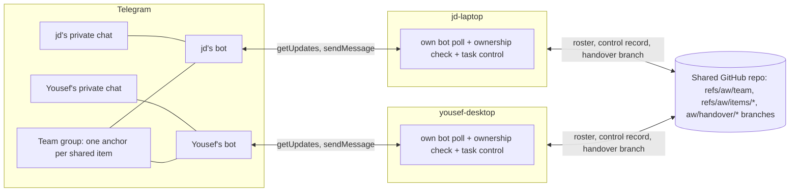

# Teammate design: one bot per person, item threads and handover

Status: design of record for team features, from jd's review on 2026-09-16.
Decisions 1 to 6 of that review are settled; this document is the first full write-up of them and still awaits jd's read.
Parent: [Design baseline](README.md).
History: [the original proposal](teammate-design-proposal.md) and [the review notes](teammate-design-review-notes.md), both superseded by this document wherever they disagree.
Replaces, once folded into the baseline: the teammate parts of [User flows](user-flows.md) sections 4 to 7, [Protocol](protocol.md) sections 2, 4, 5, 7 and 8, and milestones M3, M4, M5 and L2 of the [engineering plan](engineering-plan.md).

## 1. Summary

A team is two people, each running this app on their own workstation, each with their own LLM subscription and their own Telegram bot, sharing one private GitHub repository and one private Telegram group.
No credential is ever shared.
Each workstation long-polls its own bot exactly as it does today, so personal control (L1 and L3) is untouched and keeps working whether or not the other person is online.

Telegram does the routing that a shared bot would have needed a relay for.
A button tap goes to the bot that posted the card, a reply goes to the bot whose message it answers, and a private chat only ever reaches its own person's bot.
The only routing the app decides is which workstation answers a command typed in the shared group, and it decides that from its own records.

Teamwork happens in an item thread: a pinned anchor card in the team group, with every later message about that item replying to the anchor and carrying the item's tag.
This is C1's mechanism, reused unchanged, because Telegram will not give a two-person group forum topics (section 4.5).

A thread has three levels, on the same anchor and the same records:

1. **Discuss** (R-B): the starter shares the item; both people read and talk; read-only commands only.
2. **Grant** (R-B): the item's owner grants the other person named commands on this item on the owner's workstation (context, answer, resume), revocable at any time.
3. **Handover** (R-A): the item runs on the other person's workstation from a published branch, then comes back for review and apply.

Every state change, at every level, stays an action reference with a durable receipt and a revision check on the workstation that owns it (D17).

Size of the change: 4 build slices plus one harness slice, 7 T0 and 7 T1 scenarios for threads and grants, 3 more T1 when handover lands, and 4 short real checks plus one optional, all laid out in the [engineering plan, section 3b](engineering-plan.md#3b-team-track-tm).

## 2. Requirements as interpreted

| ID | Requirement | Interpretation |
| --- | --- | --- |
| R-A | When one person's LLM allowance is about to run out, the other can continue the task on their own workstation. | A named handover: publish a branch, accept, run, return, apply. The receiver runs under their own login and subscription; whether that satisfies G01 is jd's recorded decision, taken when the handover slices start. |
| R-B | Either person can start a Telegram thread about a work item to discuss it, with no handover and no quota trigger; the item's owner can grant the other person commands that act on the owner's workstation for that item. | Either person may open the thread, on either person's item (review decision 4). Opening one on the other person's item is a request: their workstation posts the anchor when it is online and its owner confirms, because only the owning workstation can speak for an item. The owner keeps every decision and every grant. The data model keeps person ids so a third member does not need a redesign, but nothing here is built or tested for three. |
| R-C | Telegram carries all human messaging and pushes notifications; the repository carries files. | Holds. The repository also carries three small machine records no human reads: the roster, the item control record and the handover branch. There is no message relay in the repository. |
| R-D | Exactly one bot, jd's; teammates never touch BotFather; teammate setup under a minute. | **Revised by jd on 2026-09-16.** Each person creates and owns their own bot, because Telegram delivers a bot's updates to exactly one receiver, so a shared bot forces either an election or a relay between the two machines. The teammate visits BotFather once, guided by the app, so their setup is about 3 minutes rather than under one. Nothing about the team is in anyone else's hands. |
| R-E | No dependency on jd's workstation being online. | Holds completely for personal control, threads on Yousef's items, grants Yousef already holds, handover execution and joining with an already issued code. Anything that acts on jd's workstation waits for it, by D01. |
| R-F | Lean evidence: mostly T0 and T1 on the fake Telegram, a small counted set of real checks. | Section 8. No GramJS client and no T3 automation for team features. |
| R-G | Telegram-only participants without the app are out of scope. | Accepted. Group members not on the roster are ignored. |

## 3. What changes from the accepted design

### 3.1 Decisions

| ID | Change | Reason |
| --- | --- | --- |
| D01 | Keep. | Execution, database and LLM credentials stay local. |
| D02 | Small revision, 3.2. | Its original "each workstation uses its own Telegram bot in a shared task conversation" is exactly right; it only needs the team group and the roster named. |
| D03 | Keep. | |
| D04 | Revise, 3.2. | One team group; an item thread is an anchor and its replies, not a topic. |
| D05 | Revise, 3.2. | The repository carries files plus the roster and the item control record. |
| D06 | Keep. | |
| D07 | Keep. "Request takeover" becomes "Start handover", which opens or reuses the item thread. | |
| D08 | Keep. | |
| D09 | Keep, with the comparison simplified (3.3). | |
| D10 | Revise, 3.2. | It was written for handover and must not govern R-B threads. |
| D11 | Keep. | |
| D12 | Keep. | |
| D13 | Keep. "The same shared conversation" is the item thread; later handovers stay on the same anchor. | |
| D14 | Keep. | |
| D15 | Keep. | With one bot per person there is no workstation speaking for another, which is what the proposal's revision was for. |
| D16 | Revise, 3.2. | Personal, thread and handover capabilities enable separately, with different gates. |
| D17 | Revise, 3.2. | Extends the command rule to the other person in an item thread. |
| D18 | New, 3.2. | Bots, delivery and ownership. |
| D19 | New, 3.2. | Thread authority and grants. |

### 3.2 Revision texts

**D02.**
Old: "No custom central relay is required in the baseline. Each workstation uses its own Telegram bot in a shared task conversation."
New: "No custom central relay is required. Each person runs their own Telegram bot, which they create and own, and a team shares one private Telegram group that both bots belong to. No credential is shared between people. A single operator who never forms a team is unchanged."
Reason: keeps the accepted architecture and names the shared group.

**D04.**
Old: "Use one task topic in a private project group where the audience is appropriate. Link a separately created private group when task membership must be narrower."
New: "A team has one private Telegram group. Each shared work item has an item thread in it: a pinned anchor card, with every later message about the item replying to that anchor and carrying the item's tag, as in C1. Forum topics are not used, because Telegram does not offer them to a two-person group (C0). Personal items stay in each person's private chat with their own bot. Narrower per-item audiences are deferred."
Reason: C0's recorded finding, and C1 already ships the anchor mechanism.

**D05.**
Old: "Publish versioned project state and continuation context through a private Git remote. Do not use one network-mounted working directory or share a live SQLite file."
New: "Publish handover branches and their context through the team's private Git remote. The same remote carries two small machine records under `refs/aw/`: the team roster and the item control record. Human messaging never goes through Git. Do not use a network-mounted working directory or share a live SQLite file."
Reason: names exactly what the repository carries now.

**D10.**
Old: "The requester owns requirement decisions; the executor owns local access, provider and allowance decisions. Discussion alone grants neither authority."
New: "During a handover, the requester owns requirement decisions and the executor owns local access, provider and allowance decisions. In an item thread without a handover, D19 applies instead. Discussion alone grants no authority in either case."

**D16.**
Old: "Personal live Telegram control and teammate task transfer are separately enablable capabilities with separate gates. ..."
New: "Three capabilities enable separately. Personal control needs only that operator's own setup and its own bot. Item threads and grants (R-B) need a joined team and no G01 to G03 gate, because nothing runs on another person's workstation or subscription without that person's own workstation applying it. Handover (R-A) needs a joined team, G01 and G02 as revised in 3.3. A fake transport is a development tool, not a shipping state." (the rest of the old text stays).

**D17.**
Old: "The personal phone surface (L3) gives the operator enough context to decide from the phone ... Anything that changes state stays an action reference with receipts and revision checks. LLM free chat is not part of it."
New: add "The same rule holds for both people in an item thread. A slash command that would change state only renders an action card bound to the current revision; the tap on that card is the action, validated and receipted by the workstation that owns the item."

**D18 (new).**
"Each person runs their own bot and each workstation long-polls only its own bot. Telegram routes callbacks by construction: a callback query reaches the bot that sent the card, and a private chat reaches only that person's bot. In the team group both bots are administrators so they can pin messages and create invite links; LT-1 recorded that administrator bots receive plain commands, addressed commands, replies to bot messages and unanchored discussion even when `getMe.can_read_all_group_messages` is false. Each workstation therefore filters every delivered group update by ownership: it answers only for the items it owns and stays silent otherwise, and no workstation ever answers for another. Discussion that replies to an item's anchor or to nothing can be delivered to both workstations; each matches it against open questions and commands and otherwise drops it with no reply. Such a message stays in that machine's local inbox and never reaches the repository or the other machine."

**D19 (new).**
"Either person may open an item thread, including on an item the other person owns; on the other person's item this is a request that takes effect when the owning workstation confirms it. Every decision about an item belongs to the workstation that owns it. The other person may read the thread and use read-only commands. The owner may grant named capabilities (context, answer, resume) for one item and one person; a grant is revocable, ends when the thread closes or a handover starts, and never includes provider, permission, access or scope decisions, which stay with the owner's workstation settings. Grants are checked when a tap is applied, not when a card is shown."

### 3.3 Gates, boundaries, flows and milestones

| Item | Change | New text or reason |
| --- | --- | --- |
| G01 subscription delegation | Keep for handover only; does not gate threads or grants. | A grant resumes on the owner's own subscription on the owner's own workstation. jd records the handover decision when the handover slices start. |
| G02 permissions and secrets | Revise. | New: "For a trusted two-person team, Git credentials readable by same-user agent processes are a documented accepted risk (section 7). No Telegram credential is shared at all. Any wider release reinstates certified isolation." |
| G03 remote integrity | Revise. | New: "Control refs are updated only by fast-forward or compare-and-swap push; a non-fast-forward rewrite detected on fetch disables handover until inspected." Device signatures and a signed roster are removed: each person's bot and repository access already identify them. |
| G04 team governance | Revise. | New: "jd records the team's audience (two people), storage (the shared GitHub repository and the team group) and retention (everything kept) once, in `implementation.md`." |
| README boundary "One bot per registered workstation ... do not clone bot tokens" | Keep. | The review restored it: this design never clones a token. |
| README boundary "If a bot's workstation is offline, its buttons cannot be processed immediately" | Revise. | New: "A tap is processed when its owning workstation is online. Telegram drops an uncollected tap after about 2.5 minutes, the already accepted solo behaviour (commit 800fb9a), so a card whose workstation was away gets fresh buttons when it returns." |
| User flows 4 "Its own bot posts Accept and run ... Do not put the only execution approval button on the sender's bot" | Keep. | With a bot per person this is automatic: the receiver's own bot posts the Accept card. |
| User flows 5 decision owner table | Keep for handover; add D19 for threads. | |
| User flows 6 "next offer requires the original requester's authorization of the next recipient" | Defer. | With two people a further handover can only go back to the requester. |
| Protocol 2 roster signing, device keys, control-signing key | Remove (G03 revision). | |
| Protocol 3 records Approval, Command, Event, Run attempt | Simplify to the item control record and its events, section 6. | |
| Protocol 4 signed control branches under `refs/heads/aw/...` | Revise: unsigned records under `refs/aw/...`, fast-forward or compare-and-swap only, plus the handover branch under `refs/heads/aw/handover/<item>`. | Confirmed as ordinary practice by the prior-art read; LG-1 still checks it on GitHub. |
| Protocol 5 lifecycle | Simplify: LOCAL, OFFERED, CLAIMED, RUNNING, RETURNED, APPLIED, WITHDRAWN, CANCELLED, with epochs kept. STOP_REQUESTED across workstations is deferred. | Remote stop needs the local Stop control first. |
| Protocol 7 "Each local bot has one long-poll receiver" | Keep unchanged. | This design is exactly that. |
| Protocol 8 full capability comparison | Defer; compare the settings the app has (provider, model, Host access, sandbox mode, permission mode). Anything else is unknown and asks locally. | |
| Protocol 9 separate staged-state metadata | Remove. A handover publishes a snapshot commit of tracked and untracked, non-ignored files, made through a temporary index so HEAD, index and worktree are untouched. | Staged state is a local choice and does not travel. |
| M3, M4, M5 | Replaced by slice TM4 in the engineering plan, section 3b. | |
| M6 | Keep backup and restore; defer CI. | |
| L2 | Remove; replaced by TM2 and TM3. | The team surface is item threads, not an offer board. |
| L3 C1 thread registry | Keep and extend with item subjects (TM2). | |
| L3 C0 and C2 topics | Keep, independent of this design. | Personal only, and still waiting on Telegram. |
| Acceptance scenarios T13 to T36 in implementation.md | Replaced for team features by section 8. | |

## 4. Architecture

### 4.1 Code facts this design rests on (verified 2026-09-16)

- The bot record id is `telegram-<numeric bot id>` (`integrations/telegram/runtime.ts`), so two people's bots are distinct records everywhere, and `telegram_inbox`'s primary key `(bot_id, update_id)` needs no change.
- The token is read from `TELEGRAM_BOT_TOKEN` in `.env` at boot and a change needs a restart (`integrations/telegram/credentials.ts`). Each person sets their own, exactly as jd does today, so no reloadable credential is needed.
- `telegram_thread` (migration 23) already holds `subject_kind`, `subject_id`, the anchor through `status_message_id` and the states ACTIVE, PIN_PENDING and ANCHOR_GONE. Item threads add a subject kind; the anchor and reply behaviour is C1's and is not rebuilt.
- `task_control_actor` is unique on `(transport, transport_user_id, chat_id, topic_id)` with `topic_id` nullable, which is the shape a group actor needs.
- `task_control_action.action` is constrained to `save_human_response` and `answer_and_resume`, and `task_control_receipt` already enforces applied-once per action.
- `handleMessage` answers "That message is not a task question" to any reply it cannot match, which must not happen in the team group where the other person's bot may own the reply.
- `notifyWaitingTasks` posts every waiting task to every enrolled actor, so a group actor must never be enrolled for personal notifications.
- `taskSummary` accepts only the `owner` audience; a `team` audience is added, and it hides quota.
- The latest migration is 23, so this design uses 24, 25 and 26, one per slice, unless another lands first.

### 4.2 People, bots and the roster

- A person is a roster entry: a Telegram user id learned only from that person's own pairing on their own workstation, their bot id and username, and their workstation id and label.
- One workstation per person; more devices per person are deferred.
- Each workstation keeps `task_control_actor` rows for its own person's private chat, exactly as today, plus one group actor per roster person for the team group, with `topic_id` NULL.
- Which item a group actor may act on is decided by D19 when the tap is applied, never by where the card sits.
- Usernames, display names, forwarded messages and anonymous group administrators are never authority.
- Group members not on the roster are ignored without reply.
- A shared item has a team-wide item id, minted by the workstation that starts the thread and written into the control record, and every group message about the item carries a tag built from that id.
  C1's tag is built from a local task id, which the two machines number differently, so the team tag must come from the item id instead.
  `item_link` maps the item id to the local task on each side.

### 4.3 Creating the team and joining it

One-time team creation by jd, about 3 minutes:

1. jd creates a private Telegram group and adds his own bot as administrator with Pin messages and Invite users.
2. In the Agents page he chooses Create team; the app shows a code; he sends `/team <code>` in the group.
3. jd's workstation observes the chat, checks the bot's administrator rights with `getChatMember`, asks jd to confirm locally, and writes `refs/aw/team`: team id, group chat id, jd as person with his bot id and username, and jd-laptop as workstation.

Yousef joining, about 3 minutes, and jd's app may be offline for all but the last step:

1. Yousef sets up the app for personal control the same way any solo operator does: create a bot in BotFather, put the token in `.env`, start the server, pair by the `t.me/<their bot>?start=<code>` link and confirm locally.
   This is the existing L1 flow, unchanged, and it is useful on its own before any team exists.
2. jd sends Yousef a join code, `awj1.` plus base64url JSON: version, team id, group chat id, repository remote URL, invite id and a 24-hour expiry.
   It carries no credential.
3. Yousef pastes it into Join team on the Agents page.
   Their app checks the remote is reachable with `git ls-remote` using their existing Git credentials, finds or asks for the local workspace with that remote, and adds their person, bot and workstation to `refs/aw/team` by compare-and-swap push.
   A second use of the same invite id loses the race and is refused.
4. Their app then shows the one step that needs jd: "Ask jd to add @<their bot> to the team group and make it an administrator with Pin messages."
   Bots cannot add bots, so jd does this by hand, once per teammate, and jd's app shows him the same instruction with the bot username when the roster changes.
5. jd's workstation creates a one-member, one-hour invite link (`createChatInviteLink`) for Yousef the person; Yousef taps it and joins the group.

Removing a teammate: jd removes them from the roster, his workstation disables their group actor and all their grants, and he removes the person and their bot from the group.
No token rotation is needed, because no token was shared.

### 4.4 Which workstation handles an update

Telegram decides most of this on its own:

| Update | Reaches | Owner |
| --- | --- | --- |
| Callback on a card | Only the bot that sent the card | That bot's workstation, always |
| Reply to a bot message outside the team administrator group | Only the bot whose message it answers | That bot's workstation, always |
| Private chat message | Only that person's bot | That person's workstation |
| `/start <code>` pairing | Only that person's bot | That person's workstation |
| Command in the team group | Both administrator bots, including addressed commands | The workstation that owns the item the command names or the anchor it replies to. A command addressed to the other person's bot is ignored, even when this workstation owns the item. If no workstation owns the named item, only the typer's own workstation answers, with an error, so the mistake is never met with silence. |
| Discussion replying to an item's anchor | Both administrator bots | The owning workstation handles it; the other stays silent. The owner matches the reply against open questions and granted commands and otherwise drops it with no reply and no receipt. |
| Discussion replying to nothing | Both administrator bots | No item owner is implied. Each workstation drops it unless it is a recognized team-level command for its own person. |

So the only ownership decisions the app makes are the last three rows, and they are answered from local records: the item link, the thread registry and the local paired actor.
A workstation that does not own the named item stays silent, which is also why the "That message is not a task question" hint must never be sent in the team group: the reply it cannot match usually belongs to the other person's item, or is ordinary discussion.
A delivered group discussion message can be kept in each administrator bot's local inbox like any other update, which is local-only; it never reaches the repository or the other workstation.

There are no relayed updates, no workstation code in callback data and no toast that speaks for another machine.

### 4.5 Where conversations live

| Place | Holds | Created by |
| --- | --- | --- |
| Each person's private chat with their own bot | That person's personal items, quota warnings and status commands, exactly as L1 and L3 | That person, at pairing |
| Team group, anchor per item | One shared item: pinned anchor summary card, access message, questions, answers, grants, offers, completion reports and discussion, every message replying to the anchor and carrying the item tag | The workstation of whoever starts the thread |
| Team group, unanchored | Join notices and `/status` answers about the team itself | Either workstation, for its own person |

Each workstation's messages carry its label in the breadcrumb, and now also come from a visibly different bot, so both people always see which machine is speaking.
The anchor card is edited in place by the owning workstation as the item changes, and only that workstation can edit it, because a bot may only edit its own messages.
When the item completes, the anchor is updated and unpinned and grants end; if the item reopens, a new anchor is posted.

### 4.6 What goes where

| Carried by Telegram | Carried by the repository |
| --- | --- |
| Every notification, question, answer, grant, offer, acceptance, progress milestone, completion report and review request | The handover branch `aw/handover/<item>` with its snapshot and result commits |
| Summary cards and read-only views | The item control record `refs/aw/items/<item>/control` |
| All human discussion | The roster `refs/aw/team` |

The app uses its own bare clone of the remote under `.agent-console/team/remote.git` with the user's existing Git credentials, and never changes the user's checkout, index or remote configuration.

## 5. Flows

### 5.1 Start an item thread (R-B)

1. jd opens a task in the local app and chooses Discuss with Yousef, or sends `/discuss <task key>` in his private chat.
   The phone path renders a card whose tap is the action (D17).
2. jd-laptop maps the task to a global item id, posts and pins the anchor summary card in the team group with the `team` audience (no quota, no local paths, sanitized as today), and posts an access message ("Yousef: read only") with Grant buttons that only jd's taps apply.
3. Either person may start a thread on either person's item (D19).
   When Yousef starts one on jd's item, yousef-desktop posts a request card in the group and jd-laptop posts the anchor once jd confirms, because only the owning workstation can speak for the item.

### 5.2 Discuss and read-only commands

Either person writes freely; nothing written is an instruction (B10).
Replying to an item's anchor, these answer from the owning workstation with no receipt and no state change:

| Command | Who | Shows |
| --- | --- | --- |
| `/task` | Either person | The summary card content, as of now |
| `/status` | Either person | Execution, decision and receipt state of this item, and which workstation holds it |
| `/access` | Either person | Current grants and any open offer |
| `/help` | Either person | The commands this person can use here, given current grants |

### 5.3 Grant, revoke and granted commands

| Capability | Unlocks | Effect on the owner's workstation |
| --- | --- | --- |
| `context` | `/context` | Read-only: objective, completed list, decisions and assumptions, important files, the last 10 remarks and the open question, sanitized. No receipt. |
| `answer` | Reply to the item's question card, or `/answer <text>`; Save answer on the resulting card | Records the answer and keeps the task waiting (D11). |
| `resume` | `/resume`; Answer and resume on an answer card (needs `answer` too); Resume with saved answer | Starts one run with the task's last provider and model under the owner's settings. The card states "Uses jd's <provider> allowance." |

Owner-only commands, each rendering a card whose tap is the action: `/grant context|answer|resume|all`, `/revoke [capability|all]`, `/handover`, `/close`.
The access message carries the same Grant and Revoke buttons and is edited in place after each change.
A command without the grant gets "Ask jd to grant answer on this item." and nothing else.

Validation of a state-changing tap, on the owning workstation, in this order: the action reference exists and belongs to this bot, chat and message; it has not expired (10 minutes); the tapping user is the actor the card was issued to; for the other person's actions, the capability is granted now; the expected revision matches; then the existing `saveHumanResponse` or `respondAndContinue` path.
Every result is a `task_control_receipt`, and a duplicate tap returns the first receipt.
If both people answer at once, one applies and the other is rejected as a changed question.

### 5.4 Handover (R-A), outline

Detail is written when slice TM4 starts, after jd's G01 decision.
The shape is settled:

1. Trigger: Start handover on a quota warning in jd's private chat, or `/handover` on the item's anchor. Existing grants end.
2. jd-laptop holds the task and its pipeline, waits until no run owns the workspace, and creates a snapshot commit of tracked and untracked non-ignored files through a temporary index, so HEAD, index and worktree are untouched, plus a context file (objective, requirements, answers, open questions, completed and pending work, verification, recommended provider).
   Unsupported content (symlinks escaping the tree, submodule contents, LFS objects) stops the capture with a named reason.
3. jd reviews a preview and taps Publish offer.
   jd-laptop pushes branch `aw/handover/<item>`, then the control record as `OFFERED` (epoch 1, named receiver, requested provider and model).
4. yousef-desktop discovers it on the next shared-record read (5 seconds, the recorded default), compares the requested provider, model, Host access and sandbox mode with its own workspace settings, and posts its own Accept and run card from its own bot.
5. Yousef taps Accept; yousef-desktop claims by compare-and-swap push (`CLAIMED`). A withdraw that won first makes the claim fail with the current state, and the loser re-validates rather than retrying blindly: a claim that lost stays lost.
6. yousef-desktop creates a worktree of the branch, links it to a local task, runs it through the normal start path, and posts progress on the anchor.
   Requirement questions are posted by yousef-desktop and issued to jd as actor, so they apply while jd-laptop is offline; access, provider and allowance questions are asked to Yousef locally.
7. Return pushes result commits on the same branch and `RETURNED`.
   jd-laptop posts Review, Request changes and Apply.
   Apply fetches the branch and merges it in jd's checkout: a clean fast-forward or merge completes the task, releases the pipeline hold (D12) and records `APPLIED`; a conflict stops with Git's own conflict state and says so, and the phone only offers Apply when the merge is clean (Q9).
8. Request changes opens a new epoch and a fresh offer.

### 5.5 Offline and failure cases

| Case | What people see |
| --- | --- |
| Yousef taps a card from jd's bot while jd-laptop is online | Receipt toast at once, result message a few seconds later, exactly as personal control today. |
| Yousef taps while jd-laptop is offline under about 2.5 minutes | The tap is delivered when jd-laptop returns and applied if the action has not expired. |
| Yousef taps while jd-laptop is offline longer | Telegram drops the uncollected tap (already accepted, commit 800fb9a). On return the workstation renews the open card's buttons with "Buttons renewed after this workstation was offline. Tap again if you already did." |
| Either person writes a reply while the other workstation is offline | Messages wait in Telegram for 24 hours and are processed on return. |
| A tap arrives after its 10-minute action expired | Rejected with "Not applied: this action expired". No card is renewed automatically; the requester sends the item command again for a fresh action. |
| Yousef's workstation is off when the offer is published | jd sees "Waiting for yousef-desktop"; the Accept card appears when it returns. |
| jd-laptop is off when Yousef returns work | The completion report is visible at once; Apply waits for jd-laptop (D01). |
| The repository is unreachable | Threads, grants and personal control are unaffected, because they never touch it. Handover steps retry and say what they are waiting for. |
| One person's token is revoked in BotFather | Only that person's bot stops; the other person's control is unaffected. |
| The group is upgraded to a supergroup | Telegram sends a migration message carrying the new chat id. Each workstation rewrites its roster copy, group actors, thread rows and anchor pointers to the new id before processing anything else, and the panel says the group id changed. Until a workstation has done that, it treats the old id as unusable rather than posting into a dead chat. |

## 6. Protocol and data additions

Local migrations, one per slice, so each slice ships and rolls back on its own:

- **Migration 24 (TM1).**
  `team_roster(person_id, workstation_id, workstation_code, label, telegram_user_id, bot_id, bot_username, is_self, schema_version)`, a local cache of `refs/aw/team`.
  Group actors in `task_control_actor` carry a sentinel `topic_id` rather than NULL, because SQLite treats each NULL as distinct and the existing unique index would not stop duplicate group actor rows; the migration adds the sentinel convention and a unique index enforcing one group actor per roster person and chat.
- **Migration 25 (TM2).**
  `telegram_thread.subject_kind` gains `item`.
  The column has a CHECK constraint, so the table is rebuilt with its indexes and rows, and C1's existing threads must be unchanged afterwards.
  `item_link(item_id PRIMARY KEY, prompt_id, role, epoch, control_head)` maps the team-wide item id to the local task, as `requester` or `executor`; the item id is minted once by the starting workstation and is what group tags are built from.
- **Migration 26 (TM3).**
  `task_control_action.action` widens its check to add `resume_saved`, `grant`, `revoke` and `close_thread`, and gains `subject_kind` (`task` or `item`), `item_id` and `payload_json` for grant capabilities.
  This is also a CHECK change, so the table is rebuilt with its indexes and rows.
  `item_grant(item_id, person_id, capability, granted_command_id, granted_at, revoked_command_id, revoked_at)` with a unique active row per item, person and capability.
- **Handover actions** (`publish_offer`, `accept_offer`, `decline_offer`, `withdraw_offer`, `return_work`, `apply_result`, `request_changes`) are added by TM4's own migration, not before.

TM-T0-5 proves every one of these from its predecessor: rows and indexes preserved, C1 threads unchanged, and pre-upgrade cards still answering and resuming exactly once.

Settings (Task Control group): `team.enabled` and the existing workstation label.

Repository records (JSON, `schema: 1`, unknown versions kept and not processed):

| Ref | Content | Write rule |
| --- | --- | --- |
| `refs/aw/team` | `team.json`: team id, group chat id, people with their bots, workstations, used invite ids | Compare-and-swap push; re-read and re-apply on conflict. This leans on the same host behaviour as the control record below, so LG-1 settles both, and it runs before TM1 rather than waiting for handover. |
| `refs/aw/items/<item>/control` | `state.json` (state, epoch, requester, executor, branch, last command id) and `events/<command id>.json` | Fast-forward or compare-and-swap only. The remote's non-fast-forward rejection is the compare-and-swap. On an uncertain push, fetch and look for the command id before retrying. On a lost race, re-read and re-validate the transition rather than re-applying it. This rests on the host rejecting a non-fast-forward update of a ref outside `refs/heads`, which Git guarantees for branches but which is unproven for custom refs on GitHub; LG-1 proves it before TM1 starts, and if it does not hold, the record moves to an ordinary branch `aw/control/<item>`, where the guarantee is certain. |
| `refs/heads/aw/handover/<item>` | Snapshot commit, then result commits | Ordinary branch; never rewritten. |

Reused unchanged: the outbox with edits and coalescing, action references, receipts with the applied-once index, revision hashing in `humanInputState`, start intents and workspace reservation, the saved-answer hold, the task summary model (new `team` audience), the thread registry and its anchor rules, the view registry, pairing challenges, token redaction and the token sweep.

## 7. Security model

Sized for two people who trust each other and share a private repository.

| Asset or action | Protection | Deliberately not defended |
| --- | --- | --- |
| Telegram credentials | Never shared. Each person's token stays in their own `.env`, redacted in logs and covered by the token sweep. | A person losing control of their own machine. |
| Private chats | Private by construction: each person's chat is with their own bot, and the other bot cannot read it. | Nothing. This is now a real boundary rather than a convention. |
| Join codes | Single use through the roster's used invite ids, 24-hour expiry, no credential inside. | Someone who holds the code can add themselves to the roster until it expires or is used; they still need repository access to do anything. |
| Actions on a workstation | Owner-local action records, actor check against the Telegram user id from that person's own pairing, grant check at tap time, revision, expiry, message binding, idempotent receipts. | A teammate misusing a capability they were granted. |
| Strangers in the group | Not on the roster: ignored, nothing stored, nothing relayed. | Metadata a group member can see anyway. |
| Group contents | LT-1 recorded that administrator bots receive unaddressed discussion, replies to bot messages and commands even with `getMe.can_read_all_group_messages=false`. Workstations therefore treat delivery as broad and authority as local: non-owned and non-command discussion is dropped after matching, with no reply, receipt or repository write. | Anything a group member can read in the group, and delivered group messages each administrator bot keeps locally. |
| Repository | Fast-forward or compare-and-swap writes; a detected non-fast-forward rewrite of a control ref disables handover until inspected (G03). | Repository administrators rewriting history. |
| Handed-over code | The receiver never executes imported hooks, filters or setup while importing; it runs under their own local settings. | A malicious teammate, or a malicious snapshot beyond what the receiver's own permission settings stop. |

## 8. Evidence plan

### 8.1 Tiers and reuse

- T0: server tests with fake clocks and a local bare Git repository (`file://`).
- T1: the harness with two workstation environments, two bots on one fake Telegram server, one local bare repository, the fake agent and the route proxy per environment.
- No T3 automation, no GramJS client and no test-bot T3 runs for team features; the existing L1 and L3 suites stay the solo regression suite.
- Burn-in: 3 repeats, the project default.

Reused as is: `FakeTelegramServer`, `FakePhone`, the route proxy and `network.cutTelegram()`, process lifecycle helpers, the fake provider CLI, scenario tables, the coverage matrix, burn-in and the token sweep.

Added in harness slice TM0: port offsets so two environments run side by side, a second bot and a second fake user on the shared fake Telegram, group membership and administrator rights (`getChatMember`), `createChatInviteLink` and joining through it, LT-1 delivery rules for administrator bots in group messages, `network.cutGit()` per environment, and a shared bare repository per test.

### 8.2 Automated scenarios

The crucial set lives in the [engineering plan, section 3b](engineering-plan.md#3b-team-track-tm): 7 T0 scenarios, 7 T1 scenarios for threads and grants, and 3 T1 scenarios for handover.
It was cut from this design's first draft of 10 T0, 17 T1 and 6 handover rows by merging cases that prove the same rule into one table-driven scenario and by moving formatter and registry cases into their existing test files.
Every rule in section 4.4, every grant rule in 5.3 and every failure row in 5.5 that can lose or duplicate an action is still covered.

### 8.4 Real checks

| ID | Who and time | Steps | Pass |
| --- | --- | --- | --- |
| LT-1 Two bots in a group | jd, 5 min, the test bot plus a second throwaway bot | Record `getMe.can_read_all_group_messages` for both bots. Put both in a group; record `getChatMember` rights for both, pin a message, and create and use a one-member `createChatInviteLink`. Send `/status`, `/status@one-bot`, a reply to each bot's own message from someone other than its owner, and discussion replying to nothing. | Records exactly which of these each bot receives. Recorded 2026-09-16: both bots were administrators; both reported `can_read_all_group_messages=false`; plain commands, addressed commands, replies to either bot message and unanchored discussion reached both bots. The fake must model administrator delivery this broadly; routing correctness comes from ownership filtering, not Telegram privacy mode. |
| LT-3 Join | jd and Yousef, 10 min, real bots | Yousef's own L1 setup, then the join code, then jd adds their bot and sends the invite link. | Yousef's total setup recorded by stopwatch; both panels show the team; the roster has both people and both bots. |
| LT-4 Thread and grant | jd and Yousef, 5 min, throwaway workspace with the fake agent | jd starts a thread; Yousef `/resume` is refused; jd grants answer and resume; Yousef answers and resumes from their phone. | Exactly one run on jd-laptop; phone look check of the anchor card, access message and toasts on both phones. |
| LG-1 Repository refs | jd, 2 min, script | Push, fetch and compare-and-swap `refs/aw/*`; attempt a non-fast-forward; push an `aw/handover/*` branch. | Custom refs accepted, conflict rejected, no Actions run triggered. Prior art suggests this passes; if refused, fall back to `aw-*` branches with `[skip ci]`. |
| LT-5 Handover smoke (optional) | jd and Yousef, 10 min | Section 5.4 with the fake agent across the two real machines. | Result merged on jd-laptop once. |

These become H-TM rows in `human-verification.md` as their slices land.

## 9. Build slices

The slices, their order, what each proves and when each is done are in the [engineering plan, section 3b](engineering-plan.md#3b-team-track-tm): TM0 harness, TM1 team and roster, TM2 item threads, TM3 grants, TM4 handover.
Release points: after TM3, item threads and grants can be enabled with no gate; after TM4 and jd's G01 record, handover can be enabled.

## 10. Open items

1. LT-1 recorded that administrator bots in the group both receive plain commands, addressed commands, replies to either bot's message and unanchored discussion, despite `can_read_all_group_messages=false`. jd decided on 2026-09-16 to model this administrator delivery in the fake and keep correctness in the local ownership filters.
2. Four new default values, proposed and not yet recorded: team taps expire after 10 minutes; a grant lasts until revoked, the thread closes or a handover starts; a join code is single use with a 24-hour expiry; the item id is short and opaque, and the group tag built from it follows C1's tag rules.
   The proposal's 128-character topic name cap is gone with topics.
3. G01 for handover: whether Yousef running a handed-over task on their own login and subscription, after personally accepting it, counts as ordinary use. Recorded before TM4 starts.
4. Handover detail (section 5.4) is written when TM4 starts, not before.
5. Migration numbers 24 to 26 assume nothing else lands first; the L1 defects that go first must be checked for a migration.
6. Topics stay unavailable (C0). If a bot and group ever qualify, item threads can move onto real topics through the same registry seam, and this design does not need to change to allow it.
7. LG-1 runs before TM1, not with handover: the one-winner claim depends on how the host treats a non-fast-forward push of the ref shape we choose, and the fallback to an ordinary branch is a different implementation, not a different setting.
8. Handover is symmetric by construction, but only the jd to Yousef direction is in the scenario list. If the reverse ever matters, it needs its own row rather than an assumption.
